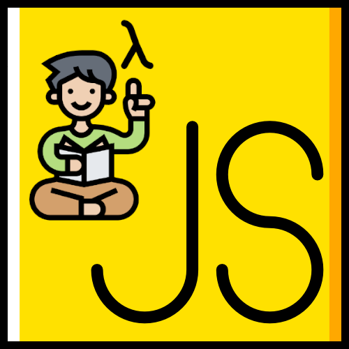

# Soy un buen programador JS

Juego con retos sencillos de JavaScript para probarte a ti mismo que sabes lo que haces.



## Solo 2 Reglas

1. Todas las variables deben ser constantes. No uses ni `let` ni `var`, solo `const`.
2. Prohibido usar los bucles: `while` y `for`.

## ¿Cómo se entrega?

Crea un Issue y pégame el código. Encantado te daré retroalimentación.

# Reto 1

Crea un `Array` con números de 0 al 10.

**Solución y entrega**: 24 de febrero

# Reto 2

A partir del siguiente `Array`.

```javascript
const miLista = ["Lisp", "Clojure", "Haskell", "PHP", "Racket"]
```

Elimina el elemento que se encuentra en la posición 3. Insisto: posición 3, no por el string "PHP".

**Solución y entrega**: 3 de marzo

# Reto 3

A partir del siguiente `Array`.

```javascript
const miLista = ["Lisp", "Clojure", "Haskell", "Elm", "Racket", "Swift", "Erlang", "Scala"]
```

Obtén el número de elementos que tienen una letra "s" en su nombre. 

Si quieres subir el nivel, no uses "length".

**Solución y entrega**: 10 de marzo

# Reto 4

Crea una función que elimine los acentos de un `string`. Prohibido usar `Regex` o `replace`.

**Solución y entrega**: 17 de marzo

# Reto 5

Crea una `Array` que muestre los primeros 10 números de la secuencia de Fibonacci.

¿Subimos el nivel? Crea una función donde le indiques la cantidad de números que quieres en la secuencia.

**Solución y entrega**: 24 de marzo
